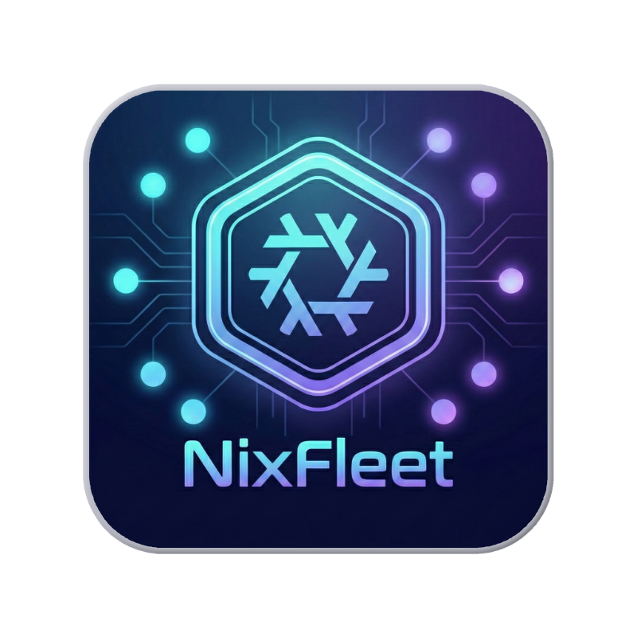

# NixFleet



> Unified fleet management for your NixOS and macOS infrastructure. Deploy, monitor, and control all your hosts from a single dashboard. 🚀

**Part of the [nixcfg](https://github.com/markus-barta/nixcfg) ecosystem** — manage your Nix fleet with confidence.

## Features

- **Web Dashboard**: View all hosts, their status, and trigger updates
- **Unified Management**: Same agent pattern for NixOS and macOS
- **Authentication**: Password + optional TOTP (2FA)
- **Agent-based**: Hosts poll for commands (works through NAT/firewalls)
- **Real-time Updates**: Server-Sent Events for live dashboard updates
- **Nix Flake**: Easy integration via flake inputs

## Architecture

```text
┌─────────────────────────────────────────────────────────────────────┐
│                        NIXFLEET DASHBOARD                           │
│                     (Docker container)                              │
│                     https://fleet.example.com                       │
└─────────────────────────────────────────────────────────────────────┘
                              │
              ┌───────────────┼───────────────┐
              │               │               │
              ▼               ▼               ▼
        ┌──────────┐    ┌──────────┐    ┌──────────┐
        │  NixOS   │    │  NixOS   │    │  macOS   │
        │  Server  │    │  Desktop │    │  Laptop  │
        │          │    │          │    │          │
        │ nixos-   │    │ nixos-   │    │ home-    │
        │ rebuild  │    │ rebuild  │    │ manager  │
        └──────────┘    └──────────┘    └──────────┘
```

## Quick Start

### 1. Add to Your Flake

```nix
{
  inputs = {
    nixpkgs.url = "github:nixos/nixpkgs/nixos-unstable";
    nixfleet.url = "github:your-org/nixfleet";
    nixfleet.inputs.nixpkgs.follows = "nixpkgs";
  };

  outputs = { nixpkgs, nixfleet, ... }: {
    # NixOS
    nixosConfigurations.myhost = nixpkgs.lib.nixosSystem {
      modules = [
        nixfleet.nixosModules.nixfleet-agent
        ./configuration.nix
      ];
    };

    # Home Manager (standalone)
    homeConfigurations.myuser = home-manager.lib.homeManagerConfiguration {
      modules = [
        nixfleet.homeManagerModules.nixfleet-agent
        ./home.nix
      ];
    };
  };
}
```

### 2. Configure the Agent

**NixOS** (`configuration.nix`):

```nix
{ config, ... }:
{
  # Load the secret (using agenix, sops-nix, etc.)
  age.secrets.nixfleet-token.file = ./secrets/nixfleet-token.age;

  services.nixfleet-agent = {
    enable = true;
    url = "https://fleet.example.com";
    tokenFile = config.age.secrets.nixfleet-token.path;
    configRepo = "/home/admin/Code/nixcfg";
    user = "admin";
    location = "cloud";      # cloud | home | work | other
    deviceType = "server";   # server | desktop | laptop | gaming | other
  };
}
```

**Home Manager / macOS** (`home.nix`):

```nix
{
  services.nixfleet-agent = {
    enable = true;
    url = "https://fleet.example.com";
    tokenFile = "/Users/myuser/.config/nixfleet/token";
    configRepo = "/Users/myuser/Code/nixcfg";
    location = "home";
    deviceType = "desktop";
  };
}
```

### 3. Deploy the Dashboard

```bash
# Clone the repo
git clone https://github.com/your-org/nixfleet.git
cd nixfleet

# Generate credentials
python3 -c "import bcrypt; print(bcrypt.hashpw(b'your-password', bcrypt.gensalt()).decode())"
openssl rand -hex 32  # NIXFLEET_SESSION_SECRETS entry (repeat for rotation, comma-separate)
openssl rand -hex 32  # NIXFLEET_AGENT_TOKEN_HASH_SECRET (hashing key for per-host agent tokens)
openssl rand -hex 32  # NIXFLEET_API_TOKEN (shared bootstrap token; optional once fully migrated)

# Create .env file
cat > .env << EOF
NIXFLEET_PASSWORD_HASH=\$2b\$12\$...your-hash...
NIXFLEET_SESSION_SECRETS=hexsecret1,hexsecret2
NIXFLEET_AGENT_TOKEN_HASH_SECRET=hexsecret
NIXFLEET_API_TOKEN=your-shared-bootstrap-token
EOF

# Start the container
docker compose up -d
```

## Module Options

### NixOS Module (`services.nixfleet-agent`)

| Option | Type | Required | Description |
|--------|------|----------|-------------|
| `enable` | bool | - | Enable the agent |
| `url` | string | **Yes** | Dashboard URL |
| `tokenFile` | path | **Yes** | Path to API token file |
| `configRepo` | string | **Yes** | Path to Nix config repo |
| `user` | string | **Yes** | User to run agent as |
| `interval` | int | No | Poll interval in seconds (default: 30) |
| `location` | enum | No | Location category (default: "other") |
| `deviceType` | enum | No | Device type (default: "server") |
| `themeColor` | string | No | Hex color for dashboard (default: "#769ff0") |

### Home Manager Module

Same options as NixOS, except `user` is not needed (runs as current user).

## Dashboard Commands

| Command | Description |
|---------|-------------|
| `pull` | Run `git pull` in the config repo |
| `switch` | Run `nixos-rebuild switch` or `home-manager switch` |
| `pull-switch` | Run both in sequence |
| `test` | Run host test suite (`hosts/<host>/tests/T*.sh`) |

## API Endpoints

| Endpoint | Method | Auth | Description |
|----------|--------|------|-------------|
| `/` | GET | Session | Dashboard UI |
| `/login` | GET/POST | - | Login page |
| `/health` | GET | - | Health check |
| `/api/hosts` | GET | Session | List all hosts |
| `/api/hosts/{id}/register` | POST | Token | Agent registration |
| `/api/hosts/{id}/poll` | GET | Token | Agent polls for commands |
| `/api/hosts/{id}/status` | POST | Token | Agent reports status |
| `/api/hosts/{id}/command` | POST | Session | Queue a command |
| `/api/hosts/{id}/agent-token` | POST | Session | Rotate per-host agent token (returns once) |
| `/api/events` | GET | Session | SSE stream for live updates |
| `/api/metrics` | GET | Session | Authenticated metrics snapshot |

## Security

- **Password**: bcrypt hashed, validated at startup
- **TOTP**: Optional 2FA via authenticator apps
- **Sessions**: DB-backed sessions + **signed session cookies** (rotation supported) + CSRF
- **Agent API**: Bearer token auth with **per-host tokens** (hashed in DB) and optional shared bootstrap token
- **Rate limiting**: Login, registration, and poll endpoints are rate-limited
- **Security headers**: HSTS, X-Frame-Options, **CSP with nonces (no `unsafe-inline`)** in production

## Environment Variables

| Variable | Required | Description |
|----------|----------|-------------|
| `NIXFLEET_PASSWORD_HASH` | Yes | bcrypt hash of admin password |
| `NIXFLEET_SESSION_SECRETS` | Yes (prod) | Comma-separated secrets for signed session cookies (rotation supported) |
| `NIXFLEET_AGENT_TOKEN_HASH_SECRET` | Yes (when using per-host tokens) | Secret used to hash per-host agent tokens in DB |
| `NIXFLEET_API_TOKEN` | Yes (prod, if shared token mode) | Shared agent token (recommended as bootstrap/migration aid only) |
| `NIXFLEET_ALLOW_SHARED_AGENT_TOKEN` | No | Allow shared token auth for agents (default: true) |
| `NIXFLEET_AUTO_PROVISION_AGENT_TOKENS` | No | Auto-create per-host tokens on first agent contact (default: true) |
| `NIXFLEET_TOTP_SECRET` | No | Base32-encoded TOTP secret for 2FA |
| `NIXFLEET_REQUIRE_TOTP` | No | Set to "true" to enforce 2FA |
| `NIXFLEET_DEV_MODE` | No | Set to "true" for development |
| `NIXFLEET_DATA_DIR` | No | Database directory (default: `/data`) |
| `NIXFLEET_TRUST_PROXY_HEADERS` | No | Trust forwarded headers for client IP (rate limiting/logging behind reverse proxies) |
| `NIXFLEET_TRUSTED_PROXY_IPS` | No | Comma-separated proxy IP allowlist (optional; when empty and trust enabled, trust any proxy) |

## Development

```bash
# Run locally
cd app
pip install -r requirements.txt
NIXFLEET_DEV_MODE=true \
NIXFLEET_PASSWORD_HASH='$2b$12$...' \
uvicorn main:app --reload
```

## License

GNU AGPL v3.0 — See [LICENSE](LICENSE) for details.
